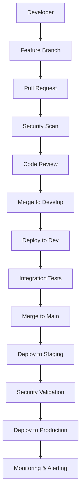

# AWS Security Projects - Architecture Overview

## Repository Structure

```
aws-security-projects/
├── .github/                           # GitHub workflows and templates
│   ├── workflows/                     # CI/CD pipelines
│   ├── ISSUE_TEMPLATE/               # Issue templates
│   ├── PULL_REQUEST_TEMPLATE.md      # PR template
│   ├── CODEOWNERS                    # Code ownership rules
│   └── branch-protection.yml         # Branch protection config
├── docs/                             # Documentation
│   ├── ARCHITECTURE.md              # This file
│   ├── DEVELOPMENT.md               # Development guidelines
│   ├── SECURITY.md                  # Security practices
│   └── templates/                   # Documentation templates
├── Domain4-Identity_and_Access_Management/
│   ├── Project1A-Multi_Identity_Provider_Federation/
│   ├── Project1B-Cross_Account_Access_Patterns/
│   └── shared/                      # Shared utilities
├── Domain5-Data_Protection/
│   ├── Project2A-KMS_Key_Management/
│   ├── Project2B-S3_Encryption_Strategies/
│   └── shared/
├── Domain6-Infrastructure_Security/
│   ├── Project3A-VPC_Security_Groups/
│   ├── Project3B-Network_ACLs/
│   └── shared/
├── shared/                           # Cross-domain utilities
│   ├── cdk-constructs/              # Reusable CDK constructs
│   ├── terraform-modules/           # Reusable Terraform modules
│   ├── scripts/                     # Utility scripts
│   └── templates/                   # Project templates
├── tools/                           # Development tools
│   ├── security-scanning/           # Security scan configurations
│   ├── deployment/                  # Deployment scripts
│   └── monitoring/                  # Monitoring and observability
└── environments/                    # Environment-specific configs
    ├── dev/
    ├── staging/
    └── prod/
```

## Domain Architecture

### Domain 4: Identity and Access Management
- **Project 1A**: Multi-Identity Provider Federation using AWS IAM Identity Center
- **Project 1B**: Cross-Account Access Patterns with AWS Organizations
- **Project 1C**: Fine-Grained Permissions with IAM Policies

### Domain 5: Data Protection
- **Project 2A**: KMS Key Management and Rotation
- **Project 2B**: S3 Encryption Strategies
- **Project 2C**: Database Encryption at Rest and in Transit

### Domain 6: Infrastructure Security
- **Project 3A**: VPC Security Groups and NACLs
- **Project 3B**: Network Monitoring and Intrusion Detection
- **Project 3C**: Infrastructure as Code Security

## Technology Stack

### Infrastructure as Code
- **AWS CDK**: Primary IaC tool using TypeScript
- **Terraform**: Alternative IaC for specific use cases
- **CloudFormation**: Native AWS templates where appropriate

### CI/CD Pipeline
- **GitHub Actions**: CI/CD orchestration
- **AWS CodePipeline**: AWS-native deployment pipelines
- **AWS CodeBuild**: Build and test execution

### Security Scanning
- **Checkov**: Infrastructure as Code security scanning
- **Semgrep**: Static Application Security Testing (SAST)
- **Snyk**: Dependency and container vulnerability scanning
- **SonarQube**: Code quality and security analysis

### Monitoring and Observability
- **AWS CloudWatch**: Metrics and logging
- **AWS X-Ray**: Distributed tracing
- **AWS Config**: Configuration compliance monitoring
- **AWS Security Hub**: Centralized security findings

## Security Architecture

### Defense in Depth
1. **Perimeter Security**: WAF, Shield, network ACLs
2. **Identity Security**: IAM policies, MFA, federation
3. **Data Security**: Encryption at rest and in transit
4. **Application Security**: SAST, DAST, dependency scanning
5. **Infrastructure Security**: Security groups, VPC design
6. **Monitoring**: CloudTrail, GuardDuty, Security Hub

### Compliance Frameworks
- **SOC 2 Type II**: Security, availability, confidentiality
- **ISO 27001**: Information security management
- **NIST Cybersecurity Framework**: Risk-based approach
- **AWS Well-Architected Security Pillar**: AWS best practices

## Deployment Environments

### Development
- **Purpose**: Feature development and initial testing
- **Resources**: Minimal AWS resources, shared services
- **Access**: All developers, automated deployments

### Staging
- **Purpose**: Pre-production testing and validation
- **Resources**: Production-like environment, isolated
- **Access**: QA team, security team, automated deployments

### Production
- **Purpose**: Live customer-facing environment
- **Resources**: Full production resources, high availability
- **Access**: Restricted access, manual approval gates

## Data Flow



## Integration Points

### AWS Services Integration
- **IAM Identity Center**: Central identity management
- **AWS Organizations**: Multi-account governance
- **AWS Config**: Configuration compliance
- **AWS SecurityHub**: Security findings aggregation
- **AWS CloudTrail**: API call logging and auditing

### Third-Party Integrations
- **GitHub**: Source code management and CI/CD
- **Slack**: Notifications and incident management
- **PagerDuty**: On-call management and escalation
- **Datadog**: Advanced monitoring and analytics

## Scalability Considerations

### Horizontal Scaling
- Modular domain structure supports independent scaling
- Shared constructs and modules reduce duplication
- Environment-specific resource sizing

### Vertical Scaling
- AWS auto-scaling capabilities
- Cost optimization through right-sizing
- Performance monitoring and optimization

## Disaster Recovery

### Backup Strategy
- Automated infrastructure backups
- Code repository redundancy
- Configuration and secrets backup

### Recovery Procedures
- Infrastructure recreation from code
- Data restoration procedures
- Business continuity planning